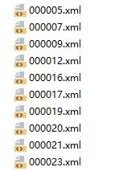
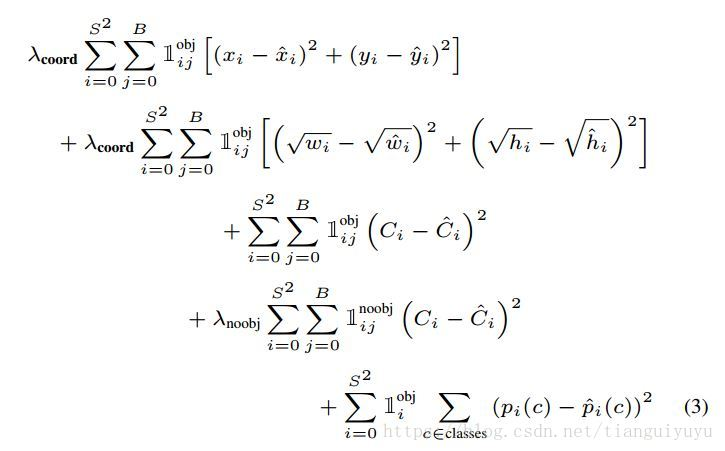
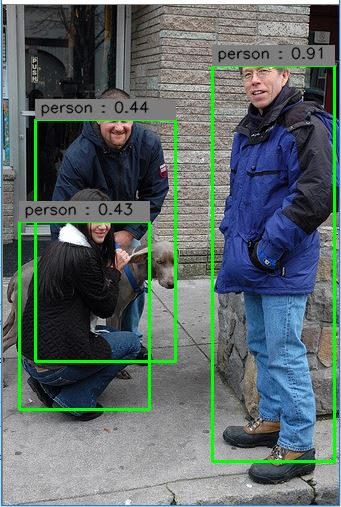

## YOLO_tensorflow
Tensorflow implementation of [YOLO](https://arxiv.org/pdf/1506.02640.pdf), including training and test phase.

### Installation


1. Download Pascal VOC dataset, and create correct directories
	```Shell
	$ ./download_data.sh
	```

2. Download [YOLO_small](https://drive.google.com/file/d/0B5aC8pI-akZUNVFZMmhmcVRpbTA/view?usp=sharing)
weight file and put it in `data/weight`

3. Modify configuration in `yolo/config.py`

4. 准备阶段
数据集的准备： ① 索引文件trainval.txt: 存放的是训练图片的名称:
 
                

                  ② 图片文件：

                  

                 ③ 标签文件xml:


                    

 

5. 网络的设计（分类训练与检测训练）


用这个网络的前20个卷积层，再在后面加一个平均池化层,接着接一个全连接层在ImageNet-1000class做分类的预训练（input size: 224*224），论文中是这样描述的（For pretraining we use the first 20 convolutional layers from Figure 3 followed by a average-pooling layer and a fully connected layer.）

 

预训练完之后，为了更好的利用细粒度的特征。将input size从(224*224)调整到(448*448)，进行检测的任务。检测的网络如上图所示，只是在分类的前20个预训练好的卷积层后面加上4个卷积层和2个全连接层，采用随机初始化的形式对这新加的4个卷积层和2个全连接层进行初始化，然后在整个检测模型上用检测数据进行fine-tuning。论文中是这样描述的（We then convert the model to perform detection. Ren etal. show that adding both convolutional and connected layers to pretrained networks can improve performance [28]. Following their example, we add four convolutional layers and two fully connected layers with randomly initialized weights. Detection often requires fine-grained visual information so we increase the input resolution of the network
from 224 × 224 to 448 × 448），训练的过程中注意label与网络的输出值一一对应即可。注意损失函数，损失函数如下：


  一句话来概括损失函数：真实有目标的区域，预测出与真实值有偏差的惩罚。真实为背景的区域，而你在这个地方预测出一个目标出来，惩罚。


6. 测试阶段：
注意处理网络的输出要和训练阶段一一对应。得到网络的输出之后，要经过几步处理。

① 将网络的输出分割成类别概率，置信度，框的位置值几个字段。

② 将类别概率与置信度一一对应相乘，得到类别置信度。

③ 进行第一步筛选，类别置信度小于设定阈值的框去掉。

④ 因为每个cell只负责预测一个类别，因此如果一个cell有两个框其类别置信度都超过了指定阈值，那么去类别置信度最大的那个框所预测出来的类别作为这个cell所预测的类别（特别注意这点）

⑤ 最后运用非极大值算法进行过滤，得出最后的结果。
	    
7. 效果显示： 运行已经训练好的模型文件（第2步下载得到，并且放到相应的文件夹下），测试结果如下： 
 
            
	    


### Requirements
1. Tensorflow

2. OpenCV
